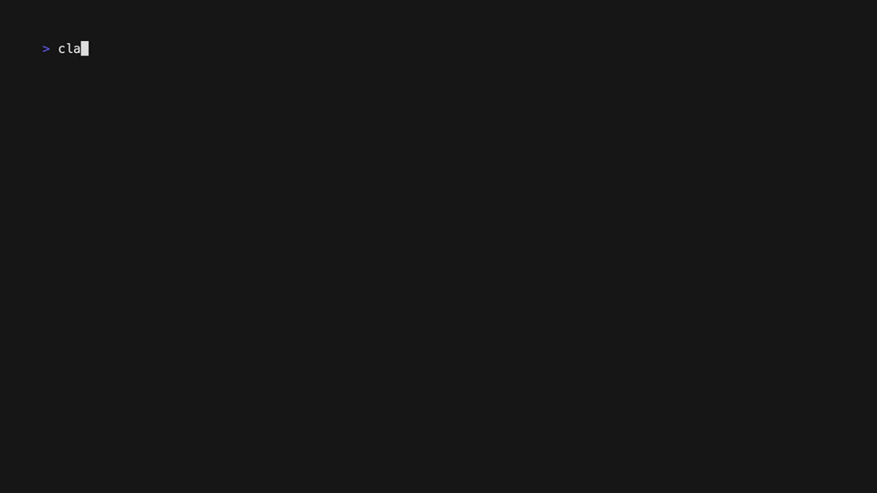
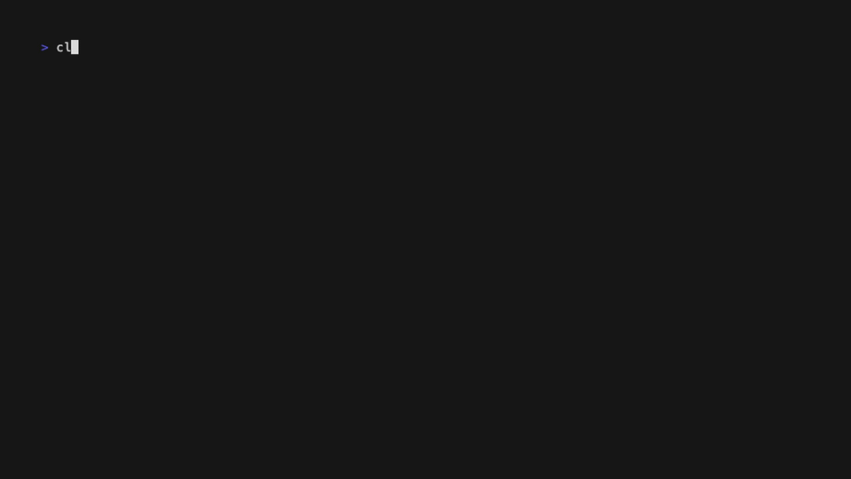

<p align="center">
  
</p>

# rotom

[](https://github.com/RyanKung/rotom/actions/workflows/ci.yml)
[](https://github.com/RyanKung/rotom/actions/workflows/release.yml)

Use Codex, Grok, Kiro, or Cursor OAuth from tools that expect OpenAI- or
Anthropic-compatible APIs.

rotom is a local Rust gateway for Claude Code, OpenAI SDKs, Anthropic SDKs, and
other API-compatible clients. Log in once with an OAuth provider, then point
your tools at the local server.

## Demo

Claude Code running through Grok:

<p align="center">
  
</p>

Claude Code running through GPT:

<p align="center">
  
</p>

## Quick Start

```bash
cargo install rotom
rotom login
rotom serve --bind 127.0.0.1:14550 --api-key local-secret
```

Use a comma-separated bind list to listen on multiple local interfaces. CIDR
entries match local IPv4 interfaces in that range:

```bash
rotom serve --bind 127.0.0.1:14550,192.168.1.0/24:14550 --api-key local-secret
```

Set Claude Code or any Anthropic-compatible client to use the local gateway:

```bash
export ANTHROPIC_BASE_URL=http://127.0.0.1:14550
export ANTHROPIC_AUTH_TOKEN=local-secret
export ANTHROPIC_MODEL="gpt-5.5"

claude
```

`login` lists the available OAuth providers and starts the selected flow. Use
`rotom login --provider openai`, `rotom login --provider grok`,
`rotom login --kiro`, or `rotom login --cursor` to skip the prompt. Codex and
Grok ask you to paste the full redirected URL from the browser address bar, for
example `http://localhost:1455/auth/callback?code=...&state=...`. This matches
OpenClaw's remote/headless fallback and does not require your gateway host to
be reachable from the public internet.

`ANTHROPIC_BASE_URL` should point at the rotom server root, not `/v1`, because
Anthropic clients append `/v1/messages` themselves.

For non-interactive validation:

```bash
ANTHROPIC_BASE_URL=http://127.0.0.1:14550 \
ANTHROPIC_AUTH_TOKEN=local-secret \
ANTHROPIC_MODEL="gpt-5.5" \
claude -p "Reply with the single word OK"
```

## Providers

Grok OAuth uses the same local credential flow with xAI's OAuth endpoints:

```bash
rotom login --provider grok
rotom serve --bind 127.0.0.1:14550 --api-key local-secret
```

Credentials are stored per provider, so logging in to Grok does not replace
Codex credentials. When both are present, `serve` exposes both Codex and Grok
models through the same local OpenAI-compatible and Anthropic-compatible routes.
Use `--provider grok` only when you intentionally want to serve one provider.
If `rotom daemon` is already running when you add a new provider, restart it so
the running service loads the new provider:

```bash
rotom daemon restart
```

xAI may still restrict OAuth API access by account tier even when browser login
succeeds.

List the model registry grouped by provider:

```bash
rotom models
rotom models --provider openai
rotom models --provider grok
rotom models --provider kiro
rotom models --provider cursor
```

Kiro login uses Kiro's own portal-style callback format and stores the result
in rotom's auth file without scanning local Kiro credential stores:

```bash
rotom login --kiro
```

The Kiro portal callback looks like
`http://localhost:3128/oauth/callback?login_option=google&code=...&state=...`.
rotom exchanges it with Kiro's desktop auth service using PKCE and saves a
normal rotom provider entry. The stored `refresh_token` value is rotom metadata
containing the Kiro refresh token, auth region, API region, profile ARN, and
User-Agent needed for refresh; raw tokens are never printed. The browser flow
currently supports Kiro social callbacks (`google` and `github`).

Explicit import from an existing official Kiro login remains available when
you intentionally want to reuse local Kiro CLI or IDE credentials:

```bash
# Prefer the Kiro CLI SQLite store when it exists:
rotom kiro import --from cli

# Or import the Kiro IDE desktop token JSON:
rotom kiro import --from desktop
```

`rotom kiro import --from auto` is opt-in. It checks the CLI store first at
`~/Library/Application Support/kiro-cli/data.sqlite3` on macOS or
`~/.local/share/kiro-cli/data.sqlite3` on Linux, then the desktop token at
`~/.aws/sso/cache/kiro-auth-token.json`. Raw Kiro tokens, client secrets, and
AWS SSO fields are never printed. Kiro credentials support import, refresh,
status, model listing, and API serving through Kiro's native event-stream
runtime.

Kiro's runtime protocol is not OpenAI or Anthropic upstream-compatible. rotom
maps compatible request shapes into Kiro's `GenerateAssistantResponse` schema:
text turns, system/developer instructions, function tools, tool results,
conversation history, inline base64 images, and inline base64 documents. Kiro
does not expose upstream fields for `temperature`, `top_p`, `max_tokens`,
`stop`, `reasoning` effort, `service_tier`, or forced `tool_choice`; rotom does
not pass those fields to Kiro. `tool_choice: "none"` is handled locally by not
sending tools. Remote image or document URLs are rejected instead of fetched by
the gateway.

Cursor login uses Cursor's browser polling flow. It prints a
`https://cursor.com/loginDeepControl?...` URL and polls Cursor for the browser
approval result; it does not start a localhost callback server:

```bash
rotom login --cursor
```

Cursor runtime support talks directly to Cursor's AgentService over
HTTPS/HTTP2 using the browser-login token. rotom does not spawn or inspect any
local Cursor binary, does not write Cursor's global
`~/.cursor/cli-config.json`, and does not grant workspace permissions. Requests
are sent as text-only ask-mode AgentService runs with a minimal context.

Cursor is an agent runtime, not an OpenAI or Anthropic model API. rotom
therefore supports text-only chat/messages/responses compatibility for Cursor.
Client-supplied OpenAI tools are rejected unless `tool_choice` is `none`, and
multimodal inputs are rejected instead of being silently dropped. Sampling and
output-length controls are not passed to Cursor because AgentService does not
expose equivalent text-only ask-mode fields.

## Use With SDKs

OpenAI-compatible chat request:

```bash
curl http://127.0.0.1:14550/v1/chat/completions \
  -H 'content-type: application/json' \
  -d '{
    "model": "gpt-5.5",
    "messages": [{"role": "user", "content": "hello"}]
  }'
```

Anthropic-compatible Messages request:

```bash
curl http://127.0.0.1:14550/v1/messages \
  -H 'content-type: application/json' \
  -H 'x-api-key: local-secret' \
  -H 'anthropic-version: 2023-06-01' \
  -d '{
    "model": "gpt-5.5",
    "max_tokens": 1024,
    "messages": [{"role": "user", "content": "hello"}]
  }'
```

## Runtime Options

Optional local API key protection:

```bash
ROTOM_API_KEY=local-secret rotom serve
curl http://127.0.0.1:14550/v1/models -H 'authorization: Bearer local-secret'
```

Interactive runtime configuration:

```bash
rotom config
rotom config show
rotom config reset
```

The config file is stored at `~/.rotom/config.json` by default and is used as
the fallback source for `rotom serve` and `rotom daemon install`.

Update to the latest published release:

```bash
rotom update
```

rotom defaults unsupported Anthropic-native model ids such as
`claude-sonnet-*` to `gpt-5.5`. To override that fallback explicitly:

```bash
ROTOM_MODEL_FALLBACK=gpt-5.5 rotom serve --api-key local-secret
```

rotom rewrites known unsupported Anthropic model ids to the effective
fallback before calling Codex. When you do not configure one explicitly, the
default fallback is `gpt-5.5`.

Common pitfalls:

- Do not set `ANTHROPIC_BASE_URL` to `http://127.0.0.1:14550/v1`; Claude
  Code appends `/v1/messages` itself.
- Use a model that `/v1/models` actually returns, such as `gpt-5.5`. If Claude
  Code defaults to `claude-sonnet-*`, the request will fail because rotom
  proxies Codex models, not Anthropic-hosted model IDs.
- `ANTHROPIC_AUTH_TOKEN` is only the local gateway key configured with
  `--api-key`; it is not your upstream OpenAI/Codex OAuth token.
- If you prefer a background service, install the daemon first and then point
  `ANTHROPIC_BASE_URL` at the daemon address instead of running `rotom serve`
  manually.

Refresh stored OAuth tokens while the server is running:

```bash
curl -X POST http://127.0.0.1:14550/v1/auth/refresh \
  -H 'authorization: Bearer local-secret'
```

From the CLI, `rotom refresh` refreshes all saved providers. Use
`rotom refresh --provider grok`, `rotom refresh --provider kiro`, or
`rotom refresh --provider cursor` to refresh only one provider.

Check the rotom version, token expiry, authentication status, strongest
highlight models, and daemon endpoints:

```bash
rotom status
rotom status --provider grok
rotom status --provider kiro
rotom status --provider cursor
```

By default, `rotom status` reports every saved provider. Use `--provider` to
inspect only one provider. The highlight list is selected from each provider's
available models by model family, version number, and capability suffix, so
live Cursor credentials can affect the Cursor highlights. When the daemon
responds on the configured bind address, `rotom status` also prints the local
API endpoint URLs.

List all model ids rotom exposes:

```bash
rotom models
rotom models --provider codex
rotom models --provider grok
rotom models --provider kiro
rotom models --provider cursor
```

`rotom models` is the full registry view. It works offline for built-in
provider lists. When Cursor credentials are available, it fetches Cursor's live
model registry; otherwise Cursor falls back to compatibility aliases.

Fetch status data over HTTP:

```bash
curl http://127.0.0.1:14550/v1/status \
  -H 'authorization: Bearer local-secret'
```

Example fields:

```json
{
  "account_id": "acc_123",
  "token": {
    "expires_at_local": "2026-05-05 12:15:07 +08:00",
    "remaining_seconds": 813427
  },
  "account": {
    "email": "user@example.com",
    "plan": "chatgptpro",
    "has_active_subscription": true
  }
}
```

Install rotom as a per-user background daemon:

```bash
rotom daemon install
rotom daemon reinstall
rotom daemon start
rotom daemon status
rotom daemon restart
rotom daemon stop
rotom daemon uninstall
```

On macOS, rotom installs a LaunchAgent at
`~/Library/LaunchAgents/com.rotom.daemon.plist`. On Linux, it installs a
systemd user unit at `~/.config/systemd/user/rotom.service`.
Windows does not currently implement native daemon/service management; use WSL
and run the Linux build there if you need `rotom daemon` commands.

On Linux, inspect the per-user service with:

```bash
rotom daemon status
systemctl --user status rotom.service
```

The daemon runs `rotom serve` with the options passed at install time. If
`--api-key` is provided, rotom stores it in `~/.rotom/config.json` instead of
embedding the secret in the launchd/systemd service definition:

```bash
rotom daemon install \
  --bind 127.0.0.1:14550 \
  --api-key local-secret
```

The daemon accepts the same comma-separated bind list and CIDR selectors as
`rotom serve`, for example `--bind 127.0.0.1:14550,192.168.1.0/24:14550`.

Models returned by `/v1/models` include the OpenAI/Codex registry:

```text
gpt-5.1
gpt-5.1-codex-max
gpt-5.1-codex-mini
gpt-5.2
gpt-5.2-codex
gpt-5.3-codex
gpt-5.3-codex-spark
gpt-5.4
gpt-5.4-mini
gpt-5.5
```

and the Grok registry:

```text
grok-4.3
grok-4.3-fast
grok-4
```

Kiro exposes the validated Kiro model registry:

```text
auto
claude-opus-4.8
claude-opus-4.7
claude-opus-4.6
claude-sonnet-4.6
claude-opus-4.5
claude-sonnet-4.5
claude-sonnet-4
claude-haiku-4.5
deepseek-3.2
minimax-m2.5
minimax-m2.1
glm-5
qwen3-coder-next
```

Cursor model availability is account-dependent. `rotom models --provider
cursor` fetches the live Cursor model registry after login; without Cursor
credentials it falls back to these compatibility aliases:

```text
cursor/auto
cursor/gpt-5
cursor/sonnet-4
cursor/sonnet-4-thinking
```

Credentials are stored at `~/.rotom/auth.json` by default. Override with
`--auth-file`, `ROTOM_AUTH_FILE`, or `ROTOM_HOME`.

Runtime config supports `model_fallback`, and the CLI accepts
`--model-fallback` / `ROTOM_MODEL_FALLBACK`. When unset, rotom defaults the
fallback to `gpt-5.5`.

OpenAI compatibility currently covers:

- `GET /v1/models`
- `POST /v1/chat/completions`
- `POST /v1/responses`
- `GET /v1/responses/{response_id}`
- `DELETE /v1/responses/{response_id}`
- `POST /v1/responses/{response_id}/cancel`
- `GET /v1/responses/{response_id}/input_items`
- `POST /v1/images/generations`
- `POST /v1/responses/compact`
- `POST /v1/responses/input_tokens`

On `POST /v1/chat/completions`, rotom accepts common OpenAI compatibility
fields such as `temperature`, `max_tokens`, `max_completion_tokens`, and
`max_output_tokens`, but the current Codex upstream rejects those parameters.
rotom therefore accepts them without error and omits them from upstream Codex
requests, so they should be treated as Codex compatibility no-ops rather than
effective sampling or output-length controls. Grok Responses requests preserve
the supported controls that xAI accepts, including `temperature`, `top_p`,
`max_output_tokens`, `stop`, `text`, `include`, and `parallel_tool_calls`.
Cursor requests are adapted directly to Cursor AgentService's HTTP/2 Connect
protocol; unsupported controls are not forwarded, and OpenAI-compatible tools
or multimodal content are rejected unless they can be represented safely in
text-only ask mode.

`/v1/responses` uses provider-specific creation paths. Codex keeps the
historical local replay behavior for existing OpenClaw and agent clients, so
simple Codex requests receive rotom-local response ids and can be retrieved,
deleted, and listed for input items while the same rotom process remains alive.
Grok requests use xAI's native Responses create API, return upstream response
ids, and mirror stored responses locally for compatibility. Grok
`previous_response_id` is forwarded to xAI when it points at an upstream-backed
response; local-only history is still replayed by rotom. Grok retrieve/delete
is forwarded to xAI for unknown ids, and upstream-backed local Grok records are
deleted upstream before the local mirror is removed. Codex resource lifecycle
calls are not claimed as upstream-supported unless the ChatGPT Codex backend
adds that API.

Image generation is exposed in two compatibility shapes:

- OpenAI-style `POST /v1/images/generations`
- OpenAI Responses hosted tool `{"type":"image_generation"}`

Current image-generation caveats:

- OpenAI `POST /v1/responses` supports streaming image-generation events
- `POST /v1/images/generations` remains non-streaming
- Anthropic `POST /v1/messages` image generation streaming is exposed as a
  rotom extension that emits `image` content blocks only once the upstream
  response completes
- generated images are returned as base64 payloads
- Anthropic compatibility uses a rotom extension that returns
  `content: [{"type":"image","source":{"type":"base64",...}}]` on
  `POST /v1/messages` when the request includes a tool named `image_generation`

Anthropic compatibility currently covers:

- `GET /v1/models` with an `anthropic-version` header
- `POST /v1/messages`
- `POST /v1/messages/count_tokens`
- `POST /v1/messages/batches`
- `GET /v1/messages/batches`
- `GET /v1/messages/batches/{batch_id}`
- `POST /v1/messages/batches/{batch_id}/cancel`
- `DELETE /v1/messages/batches/{batch_id}`
- `GET /v1/messages/batches/{batch_id}/results`
- `x-api-key` or `authorization: Bearer ...` local auth
- Anthropic-style SSE events for streaming text and tool use

Message batches execute asynchronously in a background task. Cancellation is
best-effort at request boundaries inside the batch worker: requests that have
already started are allowed to finish, while not-yet-started requests are
marked as `canceled`.

The implementation intentionally follows Ollama's compatibility strategy where
possible: Anthropic headers are accepted, locally configured auth is enforced,
and unsupported advanced Anthropic-only features are ignored rather than
rejected when possible.

The default Codex OAuth flow follows OpenClaw/pi-ai's Codex flow: PKCE, manual
paste of the `http://localhost:1455/auth/callback?...` redirect URL, token
exchange at `https://auth.openai.com/oauth/token`, and Codex requests to
`https://chatgpt.com/backend-api/codex/responses`. Grok OAuth uses xAI OIDC
discovery, PKCE, manual callback paste, and xAI Responses requests under
`https://api.x.ai/v1`. Kiro OAuth uses PKCE with `https://app.kiro.dev/signin`
and exchanges social callbacks at
`https://prod.us-east-1.auth.desktop.kiro.dev/oauth/token`. Cursor login uses
`https://cursor.com/loginDeepControl` with polling at
`https://api2.cursor.sh/auth/poll`, and runtime calls use Cursor
AgentService's HTTP/2 Connect protocol directly.

## Disclaimer

rotom is an unofficial compatibility tool. It is not affiliated with,
endorsed by, or supported by OpenAI, Anthropic, xAI, Kiro, or Cursor.

You are responsible for making sure your usage complies with the terms,
policies, account restrictions, and data-handling obligations that apply to
your upstream account and deployment environment. In particular, do not assume
that personal OAuth-backed access can be shared, resold, or safely exposed as a
multi-user hosted service. The LGPLv3 license for this repository does not
change those upstream restrictions.

## License

Copyright (c) 2026 rotom contributors.

Licensed under the GNU Lesser General Public License v3.0 only. See [LICENSE](LICENSE).
